数据结构内容：
如何用程序代码把现实世界的问题**信息化**

如何用计算机高效地处理这些信息从而创造价值

==数据结构这门课着重关注的是**数据元素之间的关系**，和对这些**数据元素的操作**，而不关心具体的数据项内容。 #F44336==

在探讨一种数据结构时：

 1. 定义**逻辑结构**（数据元素之间的关系）
 2. 定义**数据的运算**（针对现实需求，应该对这种逻辑结构进行什么样的运算）
 3. 确定某种**存储结构**，实现数据结构，并实现一些对数据结构的基本运算。

计算机/手机架构：
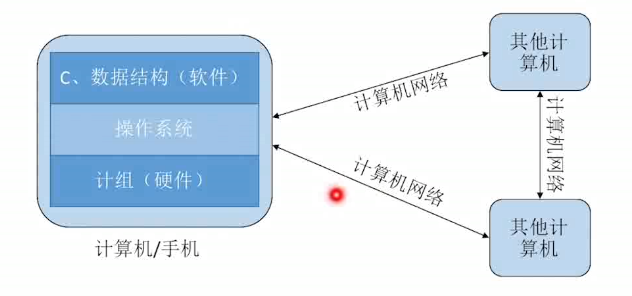


[toc!]

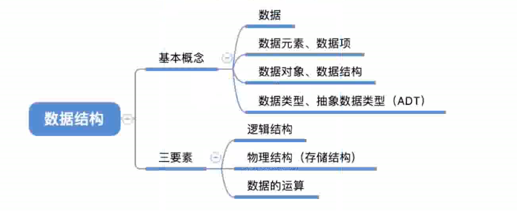

## 基本概念

### 数据

数据是信息的载体，是描述客观事物属性的数，字符及所有能输入到==计算机中并被计算机程序识别 #F44336==（01二进制）和处理的符号的集合。

### 数据元素、数据项
==数据元素 #E91E63==是数据的基本单位，通常作为一个整体进行考虑和处理。
一个数据元素可由若干==数据项 #E91E63==组成，数据项是构成数据元素的不可分割的最小单位。
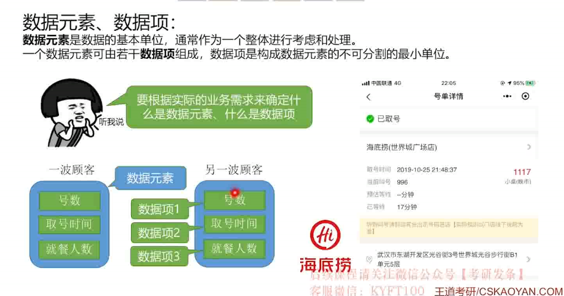
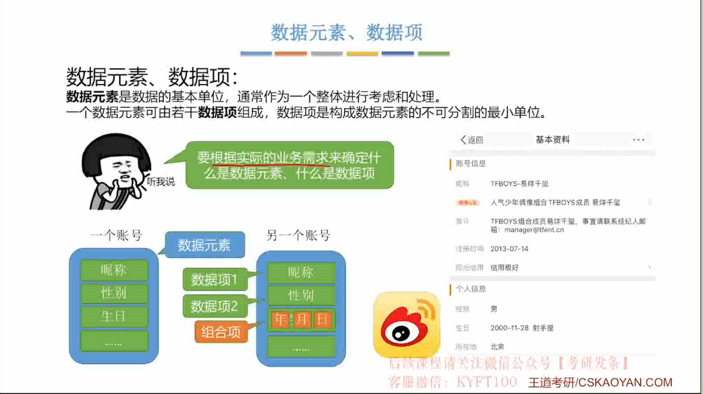
==*注意**数据元素**，**数据项**，**组合项** #E91E63==

### 数据结构和数据对象

结构---各个元素之间的关系
==数据结构 #9C27B0==是相互之间存在一种或多种特定**关系**的数据元素的集合；
==数据对象 #9C27B0==是具有**相同性质**的数据元素的集合，是数据的一个子集。
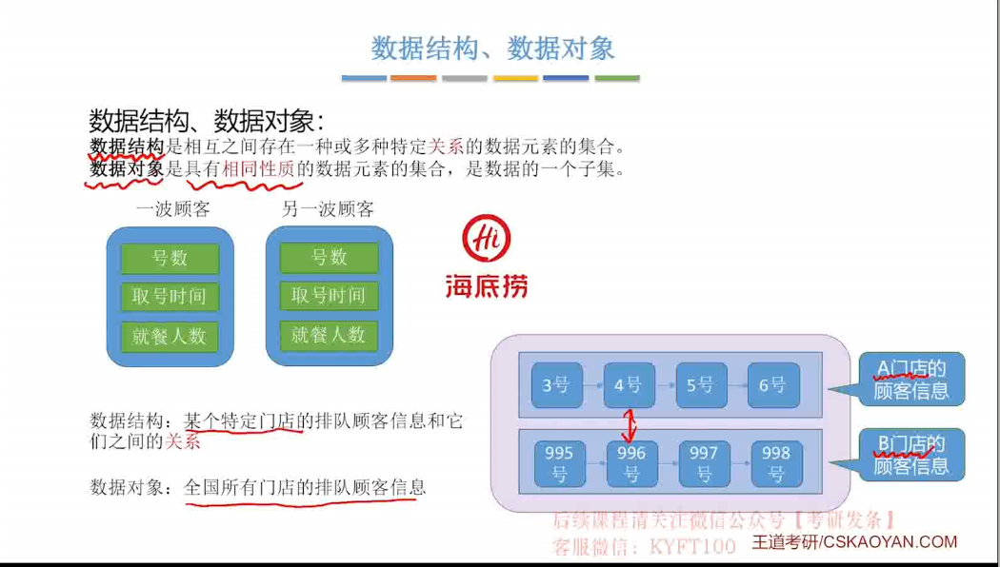

### 数据类型、抽象数据类型
数据类型是一个值的集合和定义在此集合上的一组操作的总称。

#### 原子类型
其值不可再分的数据类型。
==bool类型 #F44336==
值的范围：true，false
可进行操作：与，或，非......
==int类型 #E91E63==
值的范围：-2147483648 ~ 2147483647
可进行操作：加，减，乘，除，模运算....

#### 结构类型
其值可以再分解为若干成分（分量）的数据类型。
==C语言的结构体 #9C27B0==
``` c
struct  Customer{
int num;   //number
int people; //people
//another message

};
```
值的范围：num（1~999）、people（1~12）（可修改）
可进行操作：如果”拼桌“运算，把人数相加合并

#### 抽象数据类型
抽象数据类型（Abstract Data Type，ADT）是抽象数据组织及与之相关的操作。
ADT用数学化的语言定义数据的==逻辑结构 #F44336==、==定义运算 #F44336==。与具体的实现无关。


## 数据结构三要素

### 逻辑结构
数据元素之间的逻辑关系是什么？


#### 集合
各个元素同属一个集合，但别**无其他关系**。
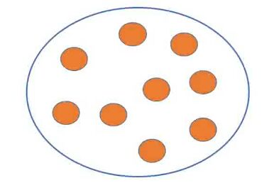
#### 线性结构
数据元素之间是**一对一**的关系。
除了第一个元素，所有元素都有==唯一前驱 #3F51B5==；
除了最后一个元素，所有元素都有==唯一后继 #673AB7==。
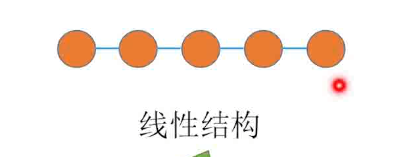

#### 树形结构
数据元素之间是**一对多**的关系。
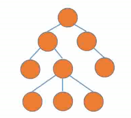
#### 图状结构（网状结构）
数据元素之间是**多对多的关系**。
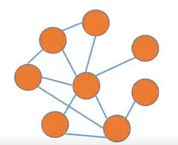
### 物理结构（存储结构）
如何用计算机表示数据元素的逻辑关系。

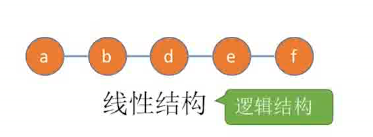

#### 顺序存储

把==逻辑上相邻的元素存储在物理位置上也相邻的存储单元中 #03A9F4==，元素之间的关系由存储单元的邻接关系来体现。
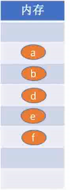

#### 链式存储
==逻辑上相邻的元素在物理位置上可以不相邻 #03A9F4==，借助指示元素存储地址的指针来表示元素之间的逻辑关系。
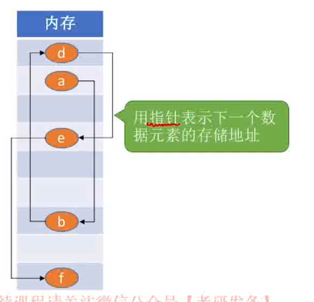

#### 索引存储

在存储元素信息的同时，还建立附加的==索引表 #F44336==。索引表的每项称为索引项，索引项的一般形式是（关键字，地址）
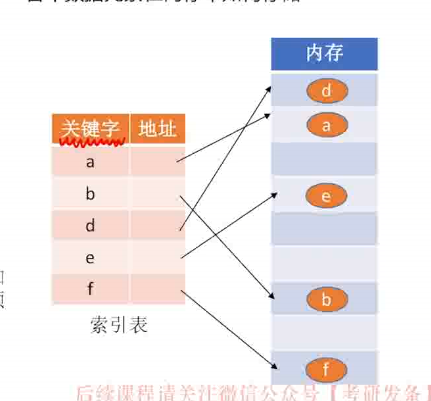

#### 散列存储
根据元素的关键字直接计算出该元素的存储地址，又称==哈希（Hash）存储 #F44336==。

：第六章，散列表。

**链式存储，索引存储，散列存储统称为==非顺序存储 #9C27B0==。**

1.若采用==顺序存储 #03A9F4==，则各个数据元素在物理上必须是==连续的 #03A9F4==；
Eg：排队

若采用==非顺序存储 #F44336==，则各个数据元素在物理上可以是==离散的 #F44336==。
Eg：银行办业务，取号坐座位


2.数据的**存储结构**会**影响存储空间分配的方便程度**。
顺序存储
Eg：有人想插队，后面的人都得往后一位。
非顺序存储
Eg：有人要来银行办业务，取号坐座位，并不影响。

3.数据的**存储结构**会影响**对数据运算的速度**。
顺序存储
Eg：找第三个人，一眼盯真。
非顺序存储
Eg：找第三个人，很蓝的啦。

### 数据的运算
施加在数据上的运算包括运算的定义和实现。
==运算的定义 #00BCD4== 是**针对逻辑结构**的，指出运算的功能；
==运算的实现 #009688==是**针对存储结构**的，指出运算的具体操作步骤。
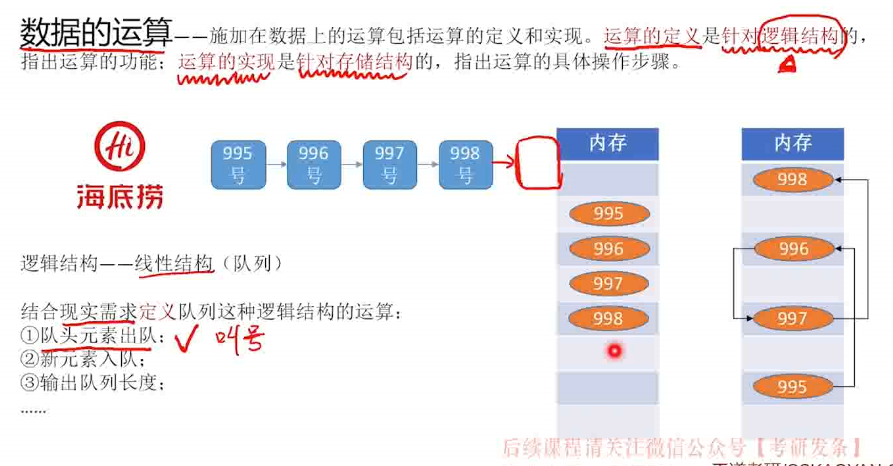
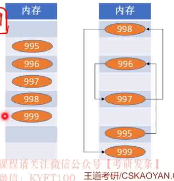

## 算法的基本概念
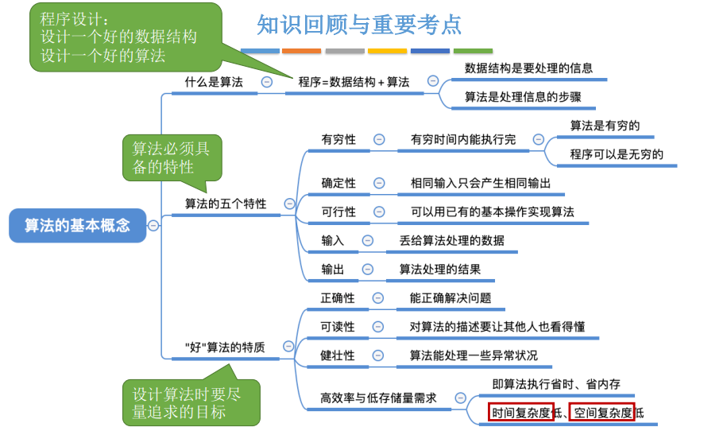
==程序 = 数据结构 + 算法 #F44336==

数据结构：
如何用数据正确地描述现实世界的问题，并存入计算机。

算法：
如何高效地处理这些数据，以解决实际问题。
#### 什么是算法
算法（Algorithm）是==对特定问题求解步骤的一种描述 #F44336==，它是指令的有限序列，其中的每条指令表示一个或多个操作
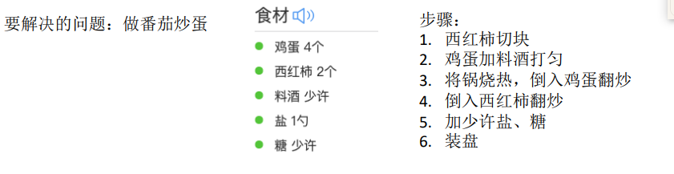
数据结构：食材
算法：要解决的问题

==算法---求解问题的步骤 #00BCD4==
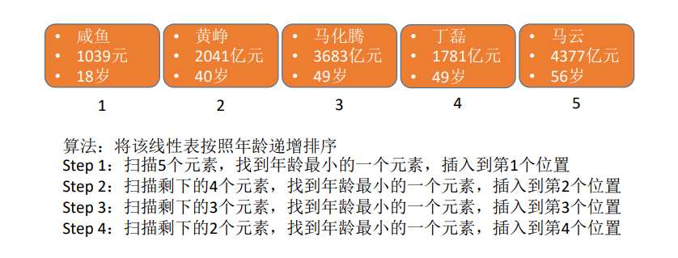

#### 算法的五个特性（必备特性）

##### 有穷性

一个算法必须总在执行**有穷步之后结束**，且每一步都可在**有穷时间内完成**。
==算法 #F44336==是用有限步骤解决某个特定的问题，必须为有穷。

==程序 #9C27B0==可以是无穷，比如微信是程序。

##### 确定性
算法中每条指令必须有确切的含义，对于**相同的输入**只能得出**相同的输出**。
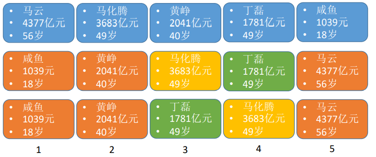
==处理后应该只能得出一个输出。 #03A9F4==

##### 可行性
算法中描述的操作都可以通过已经实现的*基本运算执行**有限次***来实现。

##### 输入

一个算法**有零个或多个输入**，这些输入取自于某个特定的对象的集合。

##### 输出 

一个算法**有一个或多个输出**，这些输出是与输入有着某种特定关系的量。
#### “好”算法的特质
==设计算法时要**尽量追求**的目标 #FF9800==

##### 正确性

算法应能够正确地解决求解问题。

错误示例：
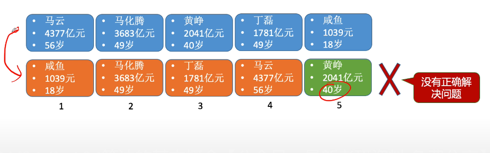
这个算法可以称为算法，但不能称为好算法。

##### 可读性
算法应具有良好的==可读性 #F44336==，以帮助人们理解。

==写了个代码：
第二天，这个是谁写的！TM都看不懂。
哦...原来是我。 #9E9E9E==

**代码　／／注释**　==（太重要了） #9E9E9E==

##### 健壮性
输入非法数据时，算法能适当地做出反应或进行处理，而不会产生莫名其妙的输出结果。

错误示例：
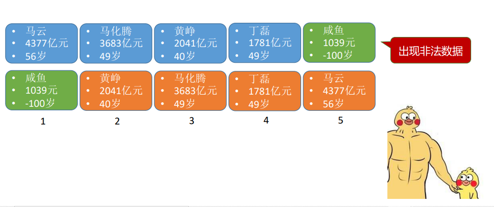

##### 高效率与低存储量需求
高效率　＝＝　花的时间少　＝＝　时间复杂度低
低存储量需求　＝＝不费内存　＝＝　空间复杂度低　

## 算法效率的度量

#### 时间复杂度

时间开销与问题规模n之间的关系。


**如何评估算法时间开销？**


==让算法先运行，事后统计运行时间？ #F44336==

==存在什么问题？ #E91E63==

 - 和机器性能有关，如：超级计算机v.s.单片机
 - 和编程语言有关，越高级的语言执行效率越低
 - 和编译程序产生的机器指令质量有关
  ==（能否排除与算法本身无关的外界因素） #9E9E9E==
 - 有些算法是不能事后再统计的，如：**导弹控制算法**。
==（能否事先估计？） #9E9E9E==

==算法时间复杂度 #00BCD4==
**事前预估**算法**时间开销T(n)** 与**问题规模n**的关系（T表示“time”）


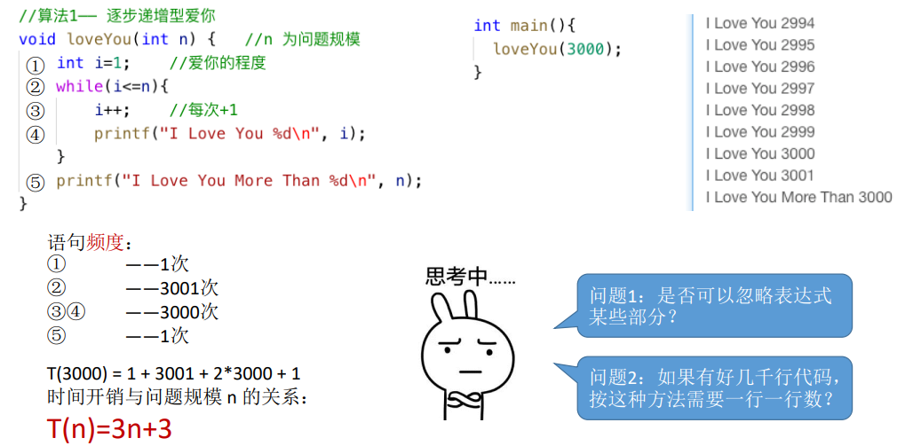
==问题1：是否可以忽略表达式某些部分？ #F44336==
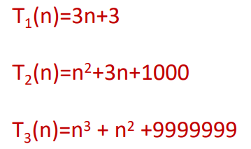
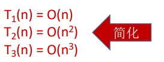
==若n足够大，则可以只考虑阶数高的部分。 #4CAF50==
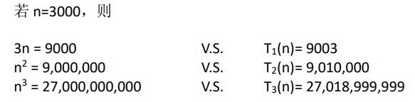

==结论1：可以只考虑阶数高的部分 #F44336==

==结论2：问题规模足够大时，常数项系数也可以忽略。 #F44336==
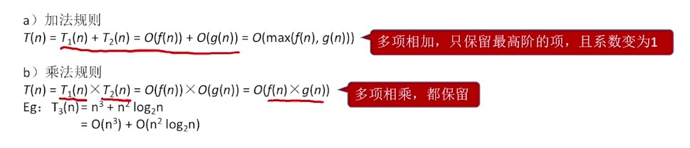
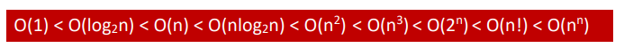
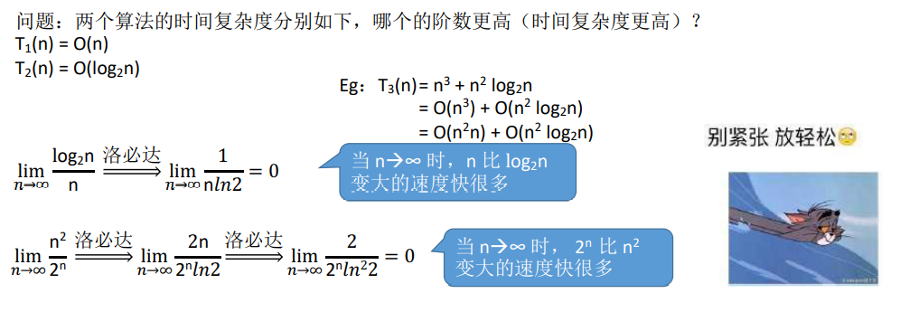

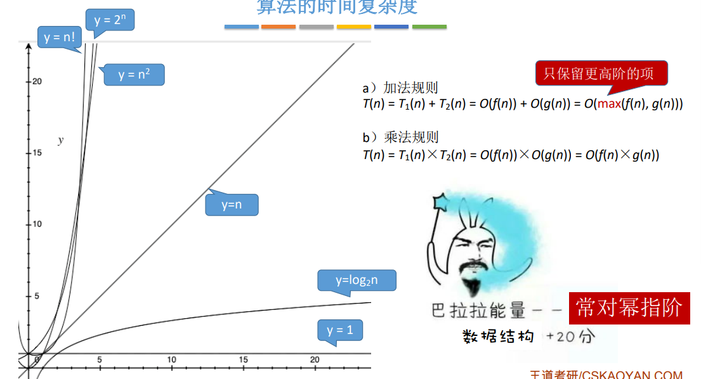


==问题2：如果有好几千行代码，按这种方法需要一行一行数？ #03A9F4==
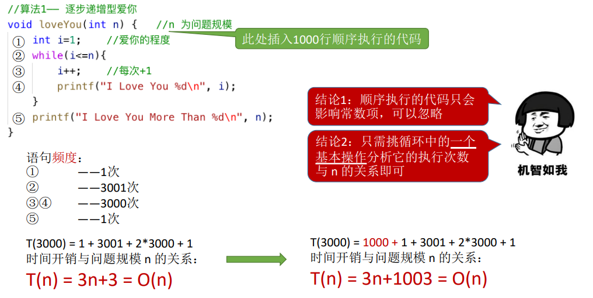
==结论1：顺序执行的代码只会影响常数项，可以忽略。 #03A9F4==

==结论2：只需挑循环中的一个基本操作分析它的执行次数与n的关系即可。 #03A9F4==
只需要看2，3，4语句，不用看1，5。

==结论3：如果有多层嵌套循坏，只需关注最深层循环循环了几次。 #FF5722==
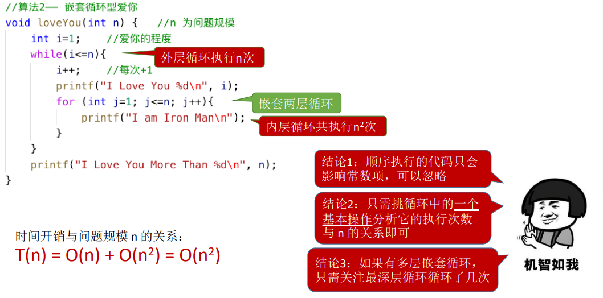

==问题1：是否可以忽略表达式某些部分？ #F44336==
==只考虑阶数，用大o记法表示。 #03A9F4==
==问题2：如果有好几千行代码，按这种方法需要一行一行数？ #F44336==
==只考虑最深层循环的循环次数与n的关系。 #03A9F4==


小练习1：

``` c
viod loveYou(int n){
int i =1;
while(i<=n){
i = i*2
printf("I Love You %d\n", i);
}
printf("I LoveYou More Than %d\n" , n);
}
```
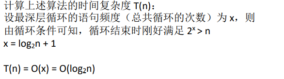

 小练习2：
 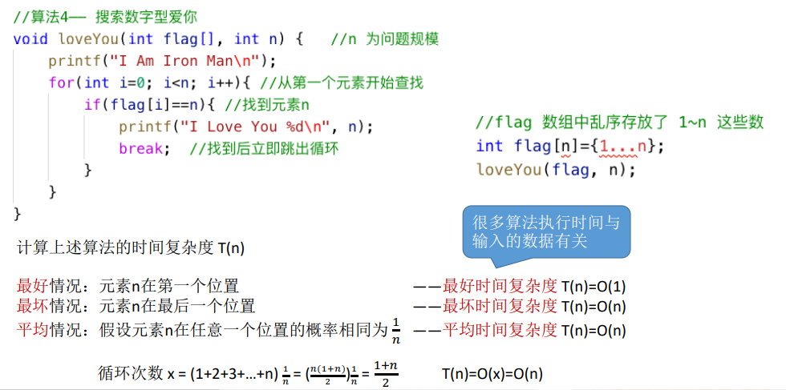

**最坏时间复杂度**：最坏情况下算法的时间复杂度

**平均时间复杂度**：所有输入示例等概率出现的情况下，算法的期望运行时间

==（比较少用） #9E9E9E==最好时间复杂度：最好情况下算法的时间复杂度

==小故事：算法的性能问题只有在n很大时才会暴露出来。 #9C27B0==
视频 29：00 ~

==算法的时间复杂度尤其重要！ #E91E63==


##### 重点：
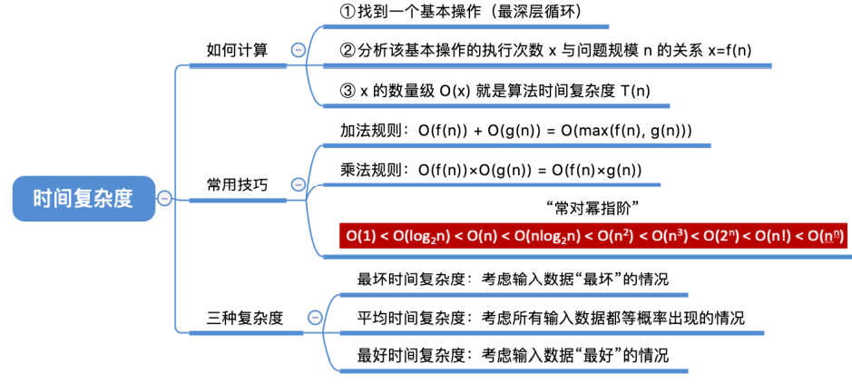

#### 空间复杂度
空间开销（内存开销）与问题规模 n 之间的关系。

**程序运行时的内存需求：**
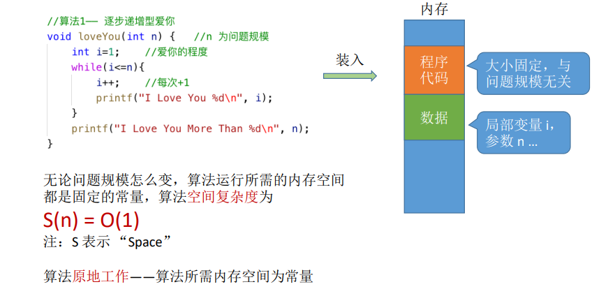
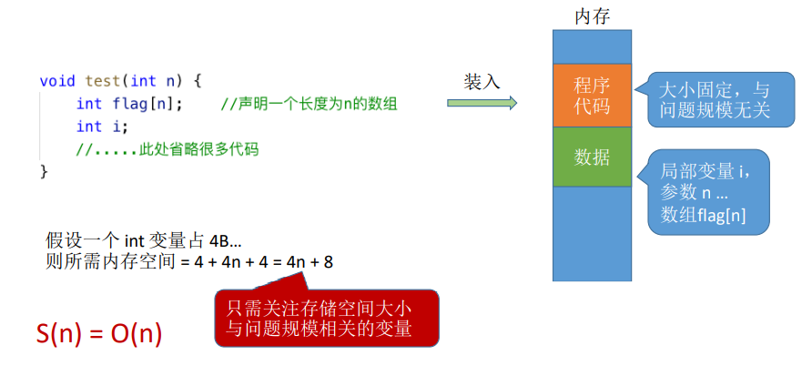
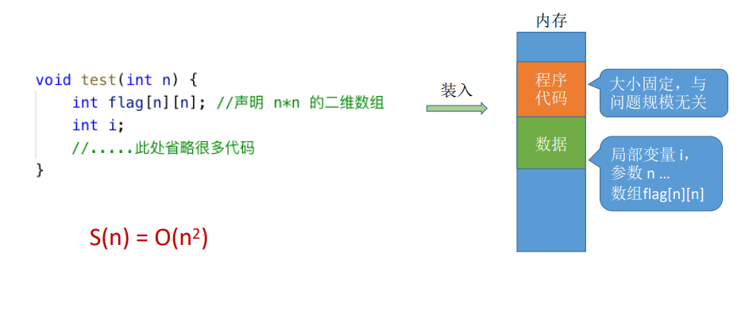
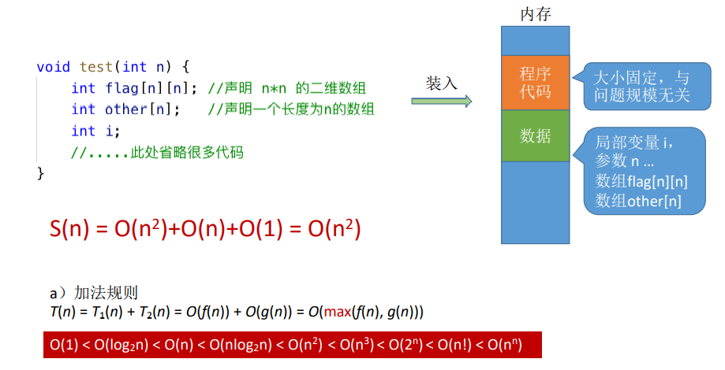

算法5——递归型爱你

``` c
void loveYou(int n)
{
int a,b,c;
//...
if (n >1)
{
loveYou(n-1);
}
printf("I Love You %d\n",n);
}

int main()
{
loveYou(5);
}
```
 ==调用后即删除函数里的数据，详细请看函数占用栈。 #F44336==
 
 递归法：
 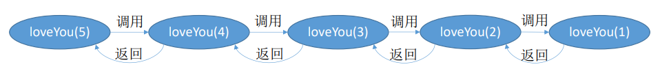
 
 
 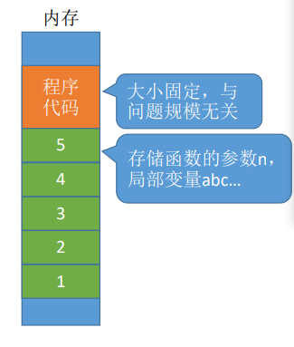
 ==（很重要） #9E9E9E====递归影响的空间复杂度： #E91E63==
 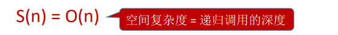
 
 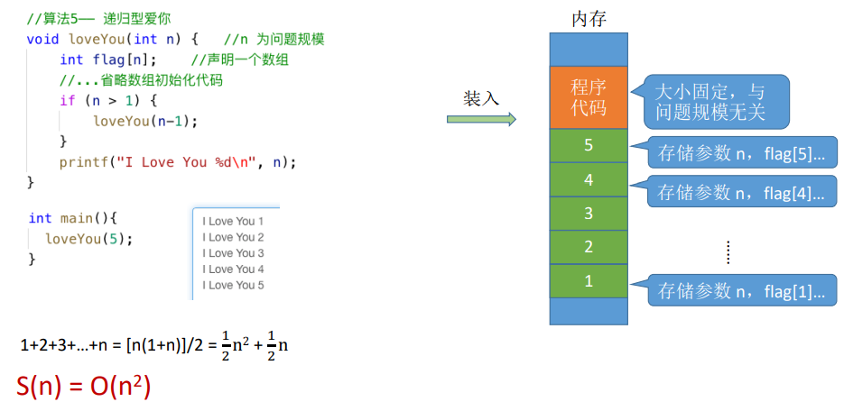

##### 重点：

 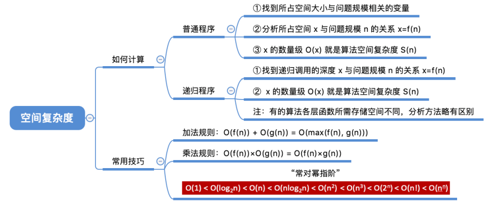