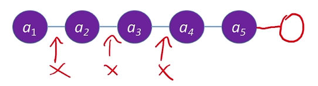
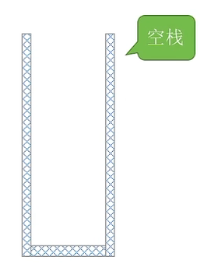
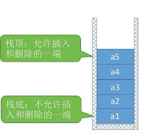
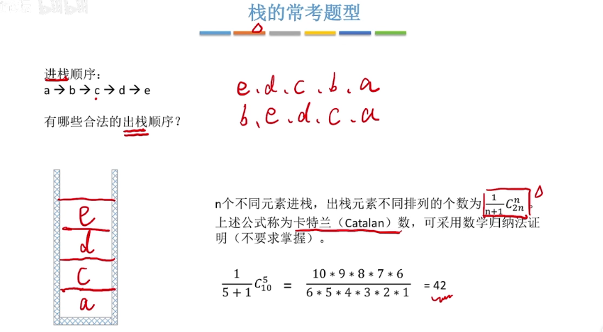

**数据结构三要素-- 逻辑结构，数据的运算，存储结构（物理结构）**

[toc!]
## 定义（逻辑结构）
栈和线性表有很大的联系。

栈 Stack 是**只允许在==一端 #F44336==进行插入或删除操作**的线性表。

重要术语：栈顶，栈底，空栈

进栈顺序：
a1 -> a2 -> a3 -> a4 -> a5

出栈顺序：
a5 -> a4 -> a3 -> a2 -> a1

特点：后进先出 ==Last In First Out (LIFO) #9E9E9E==

逻辑结构：与普通线性表相同
## 基本操作（运算）
在**插入**，**删除**操作上和普通线性表有区别。

**创，销：**
==InitStack(&S) #F44336==
初始化栈。构造一个空栈S,分配内存空间。
==DestroyStack(&L) #E91E63==
销毁栈。销毁并释放栈S所占用的内存空间。

**增，删：**
==Push(&S,x) #9C27B0==
进栈，若栈S未满，则将x加入使之成为新栈顶。
==Pop(&s,&x) #673AB7==
出栈，若栈S非空，则弹出栈顶元素，并用x返回。

**查：**
==GetTop(S,&x) #00BCD4==
读栈顶元素。若栈S非空，则用x返回栈顶元素。

**其他常用操作：**
==StackEmpty(S) #3F51B5==
判断一个栈S是否为空。若S为空，则返回true，否则返回false。

