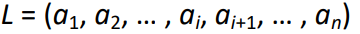
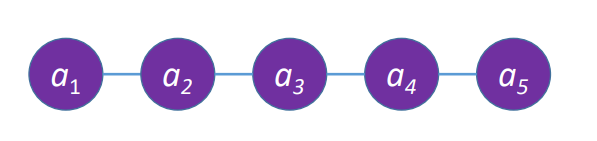
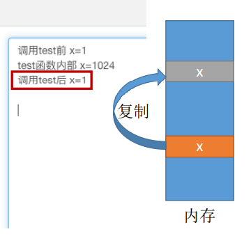
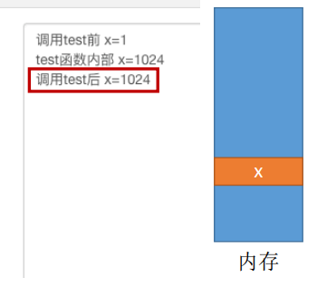
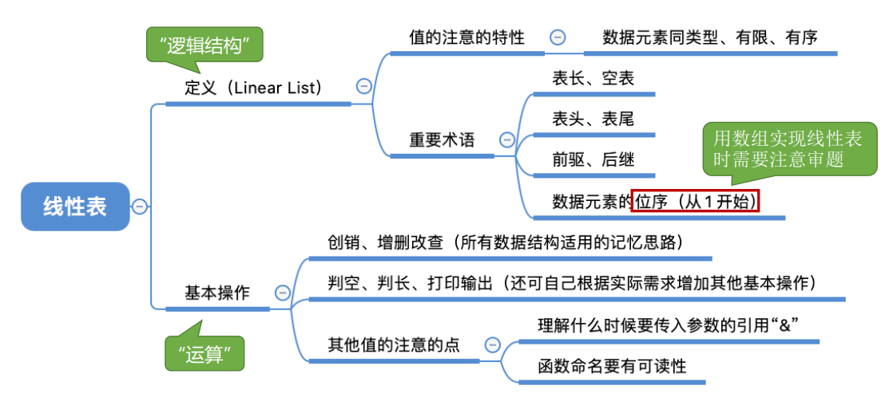

## 定义
数据结构三要素————逻辑结构

线性表是具有**相同** ==（每个数据元素所占空间一样大） #9E9E9E== 数据类型的n（n≥0）个**数据元素**的**有限 序列**==（有次序） #9E9E9E==，其中n为表长，当n = 0时线性表是一个**空表**。若用L命名线性表，则其一般表示为


几个概念：
ai是线性表中的”第i个“元素线性表中的**位序** ==（注意：为序从1开始数组下标从0开始） #9E9E9E==
a1是**表头元素**；
an是**表尾元素**。
除第一个元素外，每个元素有且仅有一个**直接前驱**；
除最后一个元素外，每个元素有且仅有一个**直接后继**。



{线性表}(Linear List)  
Linear = 线型的
List = 列表


## 基本操作
数据结构三要素————数据的运算

为什么要实现对数据结构的基本操作？
①团队合作编程，你定义的数据结构要让别人能够很方便的使用（封装）
②将常用的操作/运算封装成函数，避免重复工作，降低出错风险。

==InitList(&L) #F44336== 
初始化表。构造一个空的线性表L，分配内存空间。==&L（引用L）是C++写法 #9E9E9E==

==DestroyList(&L) #E91E63==
销毁操作。销毁线性表，并释放线性表L所占用的**内存空间** ==从无到有
从有到无 #9E9E9E==。

==ListInsert(&L,i,e) #9C27B0==
插入操作。在表L中的第i个位置上插入指定元素e。 e可以是int ，struct

==ListDelete(&L,i,&e) #673AB7==
删除操作。删除表L中第i个位置的元素，并用e返回删除元素的值 ==增加，删除 #9E9E9E==。

==LocateElem(L,e) #3F51B5==
按值查找操作。在表L中查找具有给定关键字值的元素。==改、查（“改”
之前也要“查”） #9E9E9E==

==GetElem(L,i) #2196F3==
按位查找操作。获取表L中第i个位置的元素的值。

<h3>其他常用操作:</h3>
==Length(L) #03A9F4==
求表长。返回线性表L的长度，即L中数据元素的个数。

==PrintList(L) #00BCD4==
输出操作。按前后顺序输出线性表L的所有元素值。

==Empty(L) #009688==
判空操作。若L为空表，则返回true，否则返回false。

<h3>Tips：</h3>
①对数据的操作（记忆思路） —— 创销、增删改查

②C语言函数的定义 —— <返回值类型> 函数名 (<参数1类型> 参数1，<参数2类型> 参数2，……)==为什么这里没有说明各个参数的具体类型？（函数接口具有抽象性，e可以是int也可以struct） #9E9E9E==

③实际开发中，可根据实际需求定义其他的基本操作  ==eg：更改数据很常用，即定义为基本操作 #9E9E9E==

④函数名和参数的形式、命名都可改变（Reference：严蔚敏版《数据结构》）==Key:命名要有可读性 #9E9E9E==

⑤什么时候要传入引用“&” —— 对参数的修改结果需要 ==“带回来” #F44336==  <i class="fas fa-dollar-sign"></i>

``` c
void test (int x)
{
x= 1024;
printf("test函数内部 x=%d\n",x);
}

int main()
{
int x = 1;
prinf("调用test前 x=%d\n",x);
test(x);
printf("调用test后 x=%d\n",x);

}
```
结果：


==如果是引用的话： #F44336==
``` c
void test (int & x)
{
x= 1024;
printf("test函数内部 x=%d\n",x);
}

int main()
{
int x = 1;
prinf("调用test前 x=%d\n",x);
test(x);
printf("调用test后 x=%d\n",x);

}
```

 

### 线性表知识回顾


