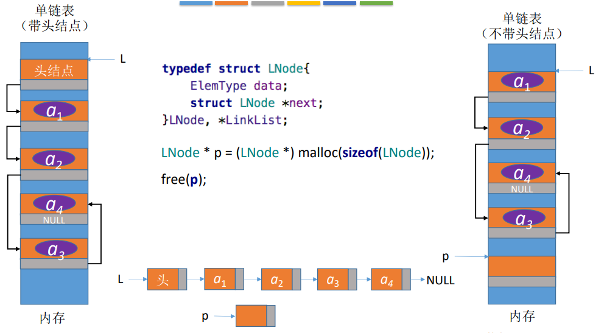
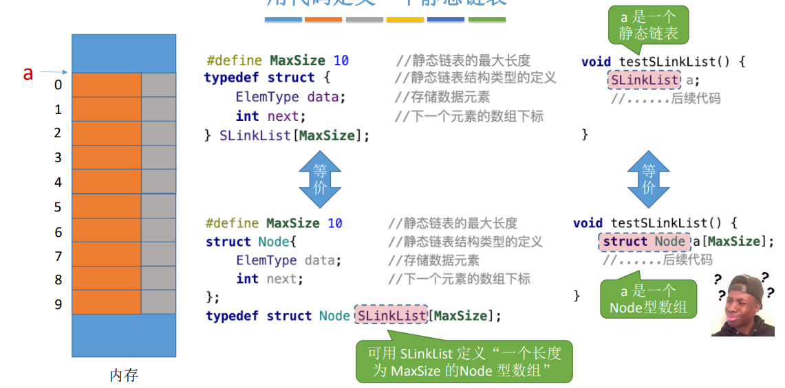

[toc!]

### 链表（链式存储）

#### 单链表

**顺序表** ==顺序存储 #9E9E9E==
==优点 #2196F3==
可以随机存取，存储密度高
==缺点 #E91E63==
要求大片连续空间，改变容量不方便

**单链表** ==链式存储 #9E9E9E==
==优点 #2196F3==
不要求大片连续空间，改变容量方便
==缺点 #E91E63==
不可随机存取，要耗费一定空间存放指针

##### 如何用代码实现


``` c
struct LNode{      //定义单链表结点类型
     ElemType data; //每个节点存放一个数据元素
	 struct LNode *next   //指针指向下一个节点
};
```

==LNode #F44336== 结点
==data #00BCD4== 数据域
==*next #FF9800== 指针域

==struct LNode * p = （struct LNode * ) malloc(sizeof(struct LNode)); #009688==
**增加一个新的结点**
在内存中申请一个结点所需空间，并用指针p指向这个结点


进行完typedef后：
typedef struct LNode LNode;
==LNode * p = （LNode * ) malloc (sizeof(LNode)); #4CAF50==

``` c
typedef struct LNode{      //定义单链表结点类型
     ElemType data; //每个节点存放一个数据元素
	 struct LNode *next   //指针指向下一个节点
}LNode, *LinkList;

struct LNode{              //定义单链表节点类型
       ElemType data;    //每个节点存放一个数据元素
	   struct LNode *next; //指针指向下一个节点
};

typedef struct LNode LNode;
typedef struct LNode *LinkList;


```
要表示一个单链表时，只需要声明一个头指针L，指向单链表的第一个结。
LNode * L;
LinkList  L ;

例子：
``` c
typedef struct LNode{      //定义单链表结点类型
     ElemType data;        //每个节点存放一个数据元素
	 struct LNode *next   //指针指向下一个节点
}LNode, *LinkList;

LNode * GetElem (LinkList L,int i){
         int j = 1;
		 LNode *p = L -> next;
         if(i == 0)
		      return L;
	     if(i < 1)
		      return NULL;
		 while(p! = NULL && j < i){
		      p = p-> next;
			  j ++;
		 }
		 return p;
		 }
```
==LinkList #F44336==
强调这是一个单链表 
==LNode * #2196F3==
强调这是一个结点


##### 两种实现

###### 不带头结点的单链表


###### 带头结点的单链表


###### 不带头结点 v.s.带头结点


##### 知识回顾 - 单链表 - 单链表 代码 两种实现


##### 插入



###### 带头结点

==ListInsert(&L,i,e) #E91E63==
插入操作
在表L中的第i个位置 ==找到第i-1个结点，将新结点插入其后 #9E9E9E== 上插入指定元素e


``` c
typedef struct LNode{
      ElemType data;
	  struct LNode *next;
}LNode, *LinkList;

//在第  i 个位置插入元素 e（带头结点）
bool ListInsert(LinkList &L , int i , ElemType e){
           if ( i < 1)
		             return false;
		   LNode *p;       //指针p指向当前扫描到的结点
		   int j=0;            //当前p指向的是第几个结点
		   p = L;             //L指向头结点，头结点是第0个结点（不存数据）
 		   while (p! = NULL && j < i - 1){    //循坏找到第 i - 1 个结点
		           p = p-> next;
				   j++;
				   }
				   if ( p == NULL )        // i值不合法
				         return false;
				   LNode *s = (LNode *)malloc(sizeof(LNode));
				   s->data  = e;
				   s-> next = p -> next;
				   p-> next = s;             //将结点 s 连到 p 之后
				   return true;               //插入成功
}


```


如果 i = 1  ==插在表头 #9E9E9E==
 ==while (p! = NULL && j < i - 1){ #00BCD4==  
 i - 1 = 0

==LNode *s = (LNode *)malloc(sizeof(LNode));
 s->data  = e; #9C27B0==
 申请一个e
 s ->data = e
 
==s-> next = p -> next; #4CAF50==
   s ==也就是e #9E9E9E== 的next 指向 p 的 next ==也就是头部 #9E9E9E==
   

 ==p-> next = s; #FFC107==  
 p ==头部 #9E9E9E== 的 next 指向 s  ==也就是 e #9E9E9E==

==注意！ #F44336== ==绿绿 #4CAF50==和==黄黄 #FFC107==顺序不能颠倒鸭。


如果 i = 3 ==插在表中 #9E9E9E==
 ==while (p! = NULL && j < i - 1){ #00BCD4==  
  i - 1 = 2
  

如果 i = 5  ==插在表尾 #9E9E9E==
 ==while (p! = NULL && j < i - 1){ #00BCD4==  
  i - 1 = 4
  

如果 i = 6 ==(i > Length) #9E9E9E==
==while (p! = NULL && j < i - 1){ #00BCD4==  
  i - 1 = 5

p = NULL  
return false;

==重点编程： #F44336==
``` c
1.
while (p! = NULL && j < i - 1) {     // 循坏找到第 i - 1 个结点
       p = p -> next;
	   j++;
}

2.
s -> next  = p -> next;
p -> next = s;           //将结点s连到p之后
```

###### 不带头结点
==ListInsert(&L,i,e) #E91E63==
插入操作
在表L中的第i个位置 ==找到第i-1个结点，将新结点插入其后 #9E9E9E== 上插入指定元素e

================思路基本一致，只是有一个地方不同： #c93737== #cd2424== #e62a2a== #d65858== #cb2424== #f60000== #d23030== #812020== 


``` c
typedef struct LNode{
      ElemType data;
	  struct LNode *next;
}LNode, *LinkList;

bool ListInsert(LinkList &L, int i , ElemType e){
    if ( i < 1)
	     return false;
    if(i == 1) {
	          LNode *s = (LNode *)malloc(sizeof(LNode));
			  s->data = e;
			  s->next = L;
			  L = s;              //头指针指向新结点
			  return true;
	 }
	LNode *p;    //指针p指向当前扫描到的结点
	int j = 1;      //当前p指向的是第几个结点
	p = L;         //p指向第1个结点 (注意： 不是头结点)
	while (p! = NULL && j < i - 1){  //循坏找到第 i - 1 个结点
	      p = p->next;
		  j++;
	}
	if (P == NULL ) //i值不合法
	           return false;
	LNode *s = (LNode *)malloc (sizeof(LNode));
	s->data = e;
	s->next = p->next;
	p->next = s;
	return true;
	
	}
}
```

==LNode *s = (LNode *)malloc(sizeof(LNode));
s->data = e; #673AB7==

开拓一个 e 空间   s->data = e

==s->next = L; #4CAF50==
s的next -> L
	
==L = s; #FFC107==    
L = s

如果 i = 1

如果 i > 1...


###### 指定结点的后插操作

``` c
// 后插操作：在p结点之后插入元素 e 
bool InsertNextNode(LNode *p, ElemType e){
     if (p == NULL)
	       return false;
     LNode *s = （LNode * ) malloc (sizeof(LNode));
	 if (s == NULL )    //内存分配失败 某些情况下有可能分配失败（如内存不足）
	         return false;
     s-> data = e;         //用结点 s 保存数据元素e
     s-> next =  p -> next;
	 p-> next = s;         //将结点s连到p之后
	        return true;
}
```

==LNode *s = （LNode * ) malloc (sizeof(LNode)); 
	 if (s == NULL )    
     s-> data = e; #673AB7== 
	 
 ==s-> next =  p -> next; #009688==
 
 ==p-> next = s; #FF9800== 
 


###### 指定结点的前插操作


``` c
//前插操作：在p结点之前插入元素e
bool InsertPriorNode(LNode *p, ElemType e){
          if (p == NULL)
		        return false;
		  LNode *s = (LNode *)malloc(sizeof(LNode));
		  if (s == NULL)     //内存分配失败
		            return false;
          s -> next = p -> next;
		  p -> next = s;                    //新结点 s 连到 p 之后
		  s -> data = p ->data;        //将p中元素复制到s中
		  p ->data = e;                    //p 中元素覆盖为 e
		       return true;
}
```

时间复杂度 ： O（1）


##### 删除
==ListDelete(&L,i,&e) #E91E63==
删除操作
删除表L中第i个位置 ==找到第i - 1个结点，将其指针指向第i+1个结点，并释放第i个结点 #9E9E9E== 的元素,并用e返回删除元素的值


``` c
typedef struct LNode{
     ElemType data;
     struct LNode *next;
}LNode, *LinkList;

bool ListDelete(LinkList &L , int i , ElemType &e ){
      if ( i < 1)
	           return false;
	  LNode *p;     //指针 p 指向当前扫描到的结点
	  int j = 0;        //当前 p 指向的是第几个结点
	  p = L;            //L 指向头结点， 头结点是第0个结点 （不存数据）
	  while (p != NULL && j < i -1 ) {  //循坏找到第 i -1 个 结点
	        p = p-> next;
			j ++;
	  }
	  if (p == NULL)    // i 值不合法
	              return false;
	  if( p -> next == NULL )     //第i-1个结点之后已无其他结点
	              return false;
	   LNode *q = p -> next;    //令 q 指向被删除结点
	   e = q -> data;                //用e返回被删除结点
	   p -> next = q -> next;    //将 *q结点从链中"断开"
	   free(q);                         //释放结点的存储空间
	       return  true;              //删除成功

}
```


###### 指定结点的删除


###### 单链表的局限性
无法逆向检索，有时候不太方便

==如果p是最后一个结点… #9C27B0==
只能从表头开始依次寻找p的前驱，时间复杂度 O(n)


##### 知识回顾-单链表的插入删除


##### 查找
==GetElem(L,i) #F44336==
按位查找        ==只探讨 ”带头结点“ 的情况 #9E9E9E==
获取表L中第i个位置的元素的值

==LocateElem(L,e) #03A9F4==
按值查找
在表L中查找具有给定关键字值的元素


###### 按位查找

先看看 插入和删除的操作
``` c
//在第 i 个位置插入元素 e （带头结点）
bool ListInsert(LinkList &L, int i, ElemType e){
      if( i < 1)
	            return  false;
	  LNode *p;
	  int j = 0;
	  p = L;
	  while (p != NULL && j < i - 1){   //循坏找到第 i - 1 个结点
	         p = p -> next
	         j++;
	  }
      if (p == NULL )
	         return false;
      LNode *s (LNode *)malloc (sizeof(LNode));
	  s->data = e;
	  s->next = p->next;
	  p->next = s;
	  return true;
}
```

```c
bool ListDelete(LinkList &L , int i , ElemType &e ){
      if ( i < 1)
	           return false;
	  LNode *p;     
	  int j = 0;        
	  p = L;            
	  while (p != NULL && j < i -1 ) {  //循坏找到第 i -1 个 结点
	        p = p-> next;
			j ++;
	  }
	  if (p == NULL)  
	              return false;
	  if( p -> next == NULL )     
	              return false;
	   LNode *q = p -> next;    
	   e = q -> data;               
	   p -> next = q -> next;   
	   free(q);                         
	       return  true;             

```

==重点 #F44336==
都是找到 第 i - 1 个结点

``` c
//按位查找，返回第 i 个元素(带头结点)
LNode * GetElem(LinkList L, int i){
    if ( i < 0 )
	          return NULL;
	LNode *p;          // 指针 p 指向当前扫描到的结点
	int j = 0;             //当前 p 指向的是第几个结点
	p = L;                //L 指向头结点， 头结点是第 0 个结点（不存数据）
	while (p! = NULL && j < i) {   //循坏找到第 i 个结点
	      p = p->next;
		  j ++;
	}
    return p;
}
```

如果 i = 0 返回p


如果 i = 8 返回NULL


如果 i = 3 


==平均时间复杂度 #F44336== ： O(n)

王道书版本

``` c
LNode * GetElem(LinkList L, int i){
    int j = 1;
	LNode *p = L ->next;
	if ( i == 0 )
	       return L;
    if ( i < 1)
	       return NULL;
	while (p != NULL && j < i){
	       p = p -> next;
		   j++;
	}
     return p;
}
```


###### 封装（基本操作）的好处
避免重复代码，简洁、易维护。


###### 按值查找

``` c
//按值查找，找到数据域 == e 的结点
LNode * LocateElem(LinkList L, ElemType e){
        LNode *p = L->next;
		// 从第1个结点开始查找数据域为 e 的结点
        while ( p != NULL && p -> data != e)
		          p = p->next;
		return p;         //找到后返回该结点指针，否则返回NULL
}
```

如果 e = 8   ==假设本例中ElemType 是 int #9E9E9E==


如果 e =6 


==平均时间复杂度 O(n) #F44336==


##### 知识回顾 - 单链表的查找


##### 尾插法

如果给你很多个数据元素（ElemType），要把它们存到一个单链表里边，咋neng呢？

step 1 ：初始化一个单链表
step 2 ：每次取一个数据元素，插入到表尾/表头

==一样，都是带头结点的情况。 #F44336==


``` c
bool ListInsert(LinkList &L, int i, ElemType e){
         if ( i < 1)
		        return false;
		LNode *p;               //指针p指向当前扫描到的结点
		int j = 0;                  //当前p指向的是第几个结点
		p = L;                     // L指向头结点，头结点是第0个结点（不存数据）
        while (p! = NULL && j< i - 1){             //循坏找到第 i - 1 个结点
		         p = p->next;
		         j++;
		}
        if ( p == NULL )         //i 值不合法
		          return false;
		LNode *s = (LNode *)malloc (sizeof(LNode));
		s->data = e;
		s->next = p->next; 
		p->next = s;              //将结点 s 连到 p 之后
		return true;              //插入成功

}
```
尾插法建立单链表：

初始化单链表

设置变量 length 记录链表长度

While 循坏{
             每次取一个数据元素 e；
		     LisInsert(L,length + 1, e)插到尾部;
			 length++;
}


``` c
//后插操作： 在p结点之后插入元素e
bool InsertNextNode (LNode *p , ElemType e){
           if ( p == NULL)
		             return  false;
		   LNode *s = (LNode *) malloc (sizeof(LNode));
		   if (s == NULL)
                        return false;
		   s->data = e;              //用结点s保存数据元素e
		   s->next = p->next;
		   p->next = s;              //将结点s连在p之后
              return true;
}
```


``` c
LinkList List_TailInsert(LinkList &L){     //正向建立单链表
    int x;                          //设ElemType 为整型
    L =(LinkList)malloc(sizeof(LNode)); //建立头结点
	LNode *s,*r = L;                    //r 为表尾指针
	scanf("%d",&x);                    //输入结点的值
    while(x! = 9999){                  //输入9999表示结束
	      s = (LNode *)malloc(sizeof(LNode));
		  s->data = x;
		  r->next = s;
		  r = s;                        //r 指向新的表尾结点
		  scanf("%d",&x);
	}
     r->next = NULL;           //尾结点指针置空
	 return L;
}
```
==L =(LinkList)malloc(sizeof(LNode)); #F44336== 
初始化空表

 ==s = (LNode *)malloc(sizeof(LNode));
		  s->data = x;
		  r->next = s; #2196F3==
在r结点之后插入元素x

==r = s #FF9800==
永远保持 r 指向最后一个结点


时间复杂度：O(n)


##### 头插法

``` c
//后插操作： 在p结点之后插入元素e
bool InsertNextNode (LNode *p , ElemType e){
           if ( p == NULL)
		             return  false;
		   LNode *s = (LNode *) malloc (sizeof(LNode));
		   if (s == NULL)
                        return false;
		   s->data = e;              //用结点s保存数据元素e
		   s->next = p->next;
		   p->next = s;              //将结点s连在p之后
              return true;
}
```

头插法建立单链表：

初始化单链表

While 循坏{
           每次取一个数据元素 e;
		   InsertNextNode(L,e);
}


``` c
LinkList List_HeadInsert(LinkList &L){     //逆向建立单链表
    LNode *s;
    int x;                          //设ElemType 为整型
    L =(LinkList)malloc(sizeof(LNode)); //建立头结点
	L->next = NULL;                   //初始为空链表
	scanf("%d",&x);                    //输入结点的值
    while(x! = 9999){                  //输入9999表示结束
	      s = (LNode *)malloc(sizeof(LNode));  //创建新结点
		  s->data = x;
		 s->next = L->next;
		  L->next = s;                      //将新结点插入表中，L为头指针
		  scanf("%d",&x);
	}
	 return L;
}
```

==L->next = NULL; #F44336== 
初始化为空链表很重要，因为你不知道他原本有没有指向其他东西

==养成好习惯，只要是初始化单链表，都先把头指针指向 NULL #673AB7==


##### 知识回顾 - 单链表的头插法与尾插法


#### 双链表


``` c
typedef struct DNode{           //定义双链表结点类型
     ElemType  data;              //数据域
     struct DNode *prior, *next; //前驱和后继指针
}DNode , *DLinklist;
```


单链表 v.s. 双链表

==单链表 #3F51B5==
无法逆向检索，有时候不太方便

==双链表 #009688==
可进可退，存储密度更低一丢丢


##### 初始化

``` c
typedef struct DNode{
        ElemType data;
		struct DNode *prior, *next;
}DNode, *DLinklist;

bool InitDLinkList(DLinklist &L){
        L = (DNode *) malloc (sizeof(DNode));    //分配一个头节点
        if (L == NULL)               //内存不足，分配失败
		            return false;
		L->prior = NULL;           //头结点的prior 永远指向 NULL
		L->next = NULL;          //头结点之后暂时还没有节点
		return true;
}

void testDLinkList(){
     //初始化双链表
     DLinklist L;
	 InitDLinkList(L);
      //后续代码...
}

//判断双链表是否为空（带头结点）
bool Empty(DLinklist L){
      if  ( L->next == NULL )
	        return true;
      else
	        return  false;
}
```


##### 插入

``` c
//在p结点之后插入 s 结点
bool InsertNextNode(DNode *p , DNode *s){
   s-> next = p -> next;      //将结点 *s插入到结点 *p之后 
   p-> next -> prior = s;
   s->prior = p;
   p->next = s;
}
```
 ==s-> next = p -> next; #4CAF50==

==p-> next -> prior = s; #FFC107==

==s->prior = p; #2196F3==

==p->next = s; #FF5722==


``` c
//在 p 结点之后插入 s 结点
bool InsertNextDNode(DNode *p, DNode *s){
     if ( p == NULL || s == NULL )    //非法参数
                   return false;
	 s-> next = p-> next;
     if ( p->next != NULL )    //如果p结点有后继续点
	      p->next -> prior = s;
	s->prior = p;
    p->next = s;
	return true;
}
```

==*修改指针时要注意顺序! #F44336==

==1. s-> next = p-> next; #4CAF50==

==2. if ( p->next != NULL )     p->next -> prior = s; #FFC107==

==3. s->prior = p; #03A9F4==

==4. p->next = s; #FF5722==


==用后插操作实现结点的插入有什么好处？ #2196F3==
按位序插入前插操作。
因为双链表的特性，前后都无所谓，都很方便的进行操作。

##### 删除

``` c
void DestoryList(DLinklist &L){
      // 循坏释放各个数据结点
        while ( L -> next  != NULL )
		         DeleteNextDNode(L);
		free(L);      //释放头结点
		L = NULL;   //头指针指向NULL
		}		
//删除p结点的后继结点
bool DeleteNextDNode (DNode *p){
       if(p == NULL)     return false;
	   DNode *q = p->next;                //找到p的后继结点q
	   if (p == NULL)    return false;          //p没有后继
	   p->next = q->next;                      
       if (q ->next != NULL)                  //q结点不是最后一个结点
	       q->next->prior = p; 
       free(q);                             //释放结点空间
	   return true;
}

```

==free(L); #009688== 
销毁表时才能删除头结点.

##### 遍历


##### 知识回顾-双链表


#### 循坏链表


##### 循坏单链表

==单链表 #673AB7==
表尾结点的next指针指向NULL

==循坏单链表 #2196F3==
表尾结点的next指针指向头结点

``` c
typedef struct LNode{       //定义单链表结点类型
       ElemType data;         //每个节点存放一个数据元素
	   struct LNode *next;   //指针指向下一个节点
}LNode,*LinkList;

//初始化一个循坏单链表
bool InitList(LinkList &L) {
     L = (LNode *) malloc(sizeof(LNode));   //分配一个头结点
	 if (L == NULL)            //内存不足，分配失败
	      return false;
	 L->next = L;           //头结点next 指向头结点
	 return true;
}

//判断循坏单链表是否为空
bool Empty(LinkList L){
   if (L->next == L)
         return true;
   else
        return false;
}

//判断结点p是否循坏单链表的表尾结点
bool isTail(LinkList L, LNode *p){
        if (p->next == L)
		        return true;
	    else
		        return false;
}
```


/判断循坏单链表是否为空
bool Empty(LinkList L){
   if (L->next == L)
         return true;
   else
        return false;
}


==单链表 #3F51B5==
从一个结点出发只能找到后续的各个结点

==循坏单链表 #2196F3==
从一个结点出发可以找到其他任何一个结点


##### 循坏双链表

==双链表 #F44336==
表头结点的 prior 指向 NULL
表尾结点的 next 指向 NULL


==循坏双链表 #FF5722==
表头结点的 prior 指向表尾结点
表尾结点的 next 指向头结点


``` c
typedef struct DNode{
      ElemType data;
	  struct DNode *prior , *next;
}DNode, *DLinklist;

//初始化空的循坏双链表
bool InitDLinkList (DLinklist &L){
           L = (DNode *)malloc (sizeof(DNode));   //分配一个头结点
		   if (L == NULL)                 //内存不足，分配失败
		             return false;
		   L->prior = L;                //头结点的 prior 指向头结点
		   L->next = L;                //头结点的 next 指向头结点
		   return true;
		   }
void testDLinkList(){
     //初始化循坏双链表
	 DLinkList L;
	 InitDLinkList(L);
      //...后续代码...
}

//判断循坏双链表是否为空
bool Empty(DLinklist L){
   if (L->next == L)
             return true;
   else
             return false;
}

//判断结点 p 是否为循坏单链表的表尾结点
bool isTail(DLinklist L, DNode *p){
      if (p->next == L)
	         return true;
	  else
	         return false;
}
```

##### 双链表的插入

``` c
//在p结点之后插入s结点
bool InsertNextDNode (DNode *p , DNode *s){
      s->next = p->next ;    //将结点 *s插入到结点 *p之后
	  p->next -> prior = s;
	  s->prior = p;
	  p->next = s;
}
```


双链表的删除
``` c
//删除p的后继结点q
   p->next = q->next;
   q->next -> prior = p;
   free(q);
```


##### 知识回顾 - 循坏链表


#### 静态链表


##### 什么是静态链表

==单链表 #F44336==
各个结点在内存中星罗棋布、散落天涯


==静态链表 #9C27B0==
分配一整片连续的内存空间，各个结点集中安置


==灰色部分是指向下一个结点的数组下标（注意这点） #F44336==
也就是 0 -> 2 -> 1 -> 6 -> 3 -> -1

每个数据元素4B，每个游标4B（每个结点共8B）
设起始地址为 addr
e1的存放地址为 addr + 8 * 2

##### 如何定义一个静态链表

``` c
#define MaxSize 10        //最大长度
struct Node{                   //结构类型的定义
      ElemType data;        //存储数据元素
	  int next;                    //下一个元素的数组下标
}

void testSLinkList(){
      struct Node a[MaxSize];
}
```




代码认证：

``` c
#define MaxSize 10   //静态链表的最大长度
struct Node{              //静态链表结构类型的定义
       int data;              //存储数据元素
	   int next;              //下一个元素的数组下标
};

typedef struct{           //静态链表结构类型的定义
     int data;                //存储数据元素
     int next;                //下一个元素的数组下标
}  SLinkList[MaxSize];

void testSLinkList(){
         struct Node x;
		 printf("sizeX = %d\n", sizeof(x));
		 
		 struct Node a[MaxSize];
		 printf("sizeA = %d\n", sizeof(a));
		 
		 SLinkList b;
		 printf("sizeB = %d\n". sizeof(b));
}
```

==结论 #4CAF50==

SLinkList b 相当于定义了一个长度为MaxSize 的 Node 型数组

==运行结果 #607D8B==
sizeX = 8
sizeA = 80
sizeB = 80

##### 简述基本操作的实现


``` c
#define MaxSize 10   //静态链表的最大长度
typedef struct{              //静态链表结构类型的定义
       ElemType data;              //存储数据元素
	   int next;              //下一个元素的数组下标
} SLinkList[MaxSize];

void testSLinkList(){
     SLinkList a;
	 //  .... 后续代码
}
```

###### 初始化

==单链表 #9C27B0==


把单链表的next 指针指向NULL即可.

==静态链表 #FF5722==


把 a[0] ==头结点 #9E9E9E== 的 next 设为 -1

把其他结点的next 设为一个特殊值用来表示结点空闲 ，如 -2

###### 查找

从头结点出发挨个往后遍历结点 
时间复杂度 为 O(n)

###### 插入

 1. 找到一个==空的结点 #F44336==，存入数据元素
 2. 从头结点出发找到位序为 i - 1 的结点
 3. 修改新结点的 next
 4. 修改 i - 1 号结点的 next


==关于空的结点 #F44336==

==如何判断结点是否为空？ #3F51B5==
可让next 为某个特殊值，如 -2
因此，初始化的时候，可以这样标记一下。


###### 删除

 1. 从头结点出发找到前驱结点
 2. 修改前驱结点的游标
 3. 被删除结点 next 设为 -2


###### 知识回顾 - 静态链表

