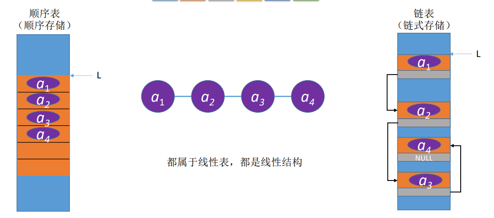
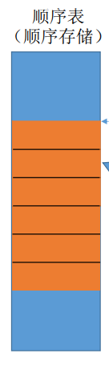
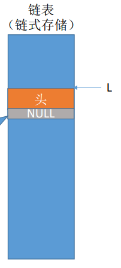
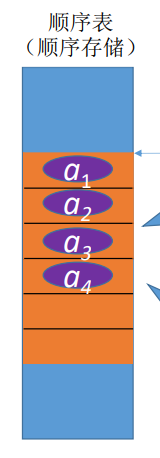
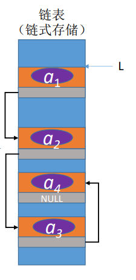
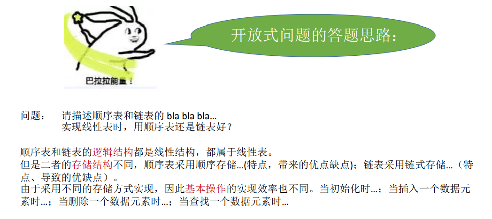

[toc!]
## Round 1 - 逻辑结构


## Round 2 - 物理结构/存储结构


==顺序表(顺序存储) #673AB7==

==优点 #2196F3==
支持随机存取，存储密度高
==缺点 #F44336==
大片连续空间分配不方便，改变容量不方便


==链表(链式存储) #009688==

==优点 #2196F3==
离散的小空间分配方便，改变容量方便
==缺点 #F44336==
不可随机存取，存储密度低

## Round 3 - 数据的运算/基本操作


==**创 = 初始化** #F44336==

销 = 销毁

==**增 = 增加数据元素** #F44336==

==**删 = 删除数据元素** #F44336==

改 = 改变数据元素

==**查 = 查找数据元素** #F44336==


### Round 3.1 创
==顺序表 #673AB7==
需要预分配大片连续空间。
若分配空间过小，则之后不方便拓展容量；若分配空间过大，则浪费内存资源。


==静态分配 #795548==
静态数组 (容量不可改变)
==动态分配 #607D8B==
动态数组（malloc、free）(容量可改变，但需要移动大量元素，时间代价高)

==链表 #009688==
只需分配一个头结点（也可以不要头结点，只声明一个头指针），之后方便拓展。



<h1>在 创 上 链表更胜一筹</h1>


### Round 3.2 销
==顺序表 #673AB7==
修改 Length = 0 

==静态分配 #795548==
系统自动回收空间
==动态分配 #607D8B==
需要手动 free

``` c
typedef struct{
      ElemType *data;
      int MaxSize;
       int length;
} SeqList;

L.data = (ElemType *) malloc (sizeof(ElemType) * InitSize); //创

free(L.data);  //销

```


==链表 #009688==
依次删除各个结点 （用free）

<h1>在 销 上 两者各有千秋 </h1>


### Round 3.3 增与删


==顺序表 #673AB7==

插入/删除元素要将后续元素都后移/前移

时间复杂度 O(n)，时间开销主要来自移动元素

若数据元素很大，则移动的时间代价很高。



==链表 #009688==

插入/删除元素只需修改指针即可

时间复杂度 O(n)，时间开销主要来自查找目标元素

查找元素的时间代价更低


<h1>在 增与删 上 链表更胜一筹</h1>


### Round 3.4 查

==顺序表 #673AB7==

按位查找： O(1)

按值查找：O(n)
若表内元素有序，可在 O(log2n)时间内找到


==链表 #009688==

按位查找：O(n)

按值查找：O(n)

==因为无论如何，链表必须得从第一个开始顺下去。 #F44336==

<h1>在 查 上 顺序表更胜一筹</h1>

## 如何抉择？！


|                | 顺序表       | 链表     |
| -------------- | ------------ | -------- |
| 弹性（可扩容） | 麻了         | 赢了     |
| 增，删         | 更麻         | 赢麻了   |
| 查             | 这次总算赢了 | 居然输了 |
表长难以预估，经常要增加/删除元素 
用 ==链表 #009688==
例如医院挂号

表长可 预估，查询（搜索）操作较多
用 ==顺序表 #673AB7==
例如学校里一班人的统计

## 重要考点 - 简答题
