[toc!]


**==顺序表——用顺序存储的方式实现线性表。 #F44336==**
线性表L逻辑结构：
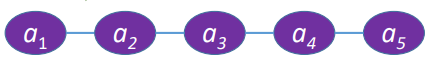
## 定义（如何用代码实现）

线性表是具有相同==每个数据元素所占空间一样大 #9E9E9E==数据类型的n（n≥0）个数据元素的有限序列

顺序存储。把**逻辑上相邻**的元素存储在**物理位置上也相邻**的存储单元中，元素之间的关系由存储单元的邻接关系来体现。
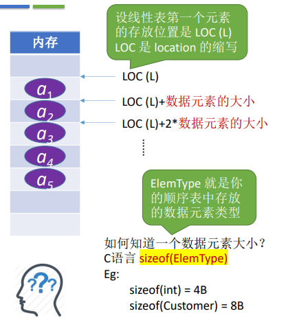
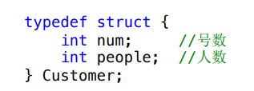

## 基本操作的实现
### 静态分配
``` c
#define MaxSize 10    //定义最大长度
typedef struct{
ElemType data[MaxSize];  //用静态的”数组“存放数据元素
int length;  //顺序表的当前长度
} SqList;   //顺序表的类型定义（静态分配方式）
```
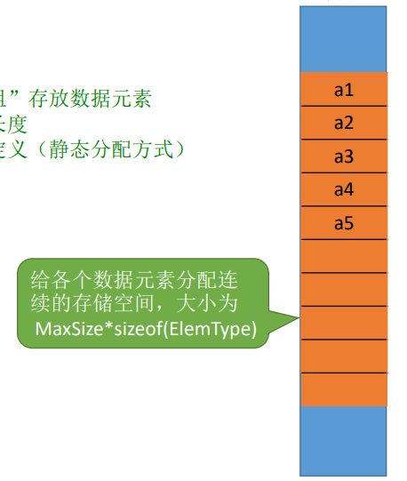
==ElemType #F44336==
**Element Type**
=int/struct
==SqList #E91E63==
Sequence List

``` c
 //本例子中数据元素（ElemType）的类型是int
#define MaxSize 10    //定义最大长度
typedef struct{
ElemType data[MaxSize];  //用静态的”数组“存放数据元素
int length;  //顺序表的当前长度
} SqList;   //顺序表的类型定义（静态分配方式）

//基础操作——初始化一个顺序表
void InitList(SqList &L){
for(int i-0;i<MaxSize;i++)//②
L.data[i] = 0; //将所有数据元素设置为默认初始值
L.length =0; //顺序表初始长度为0③
}

int main() {
SqList L;  // 声明一个顺序表①
InitList (L); // 初始化顺序表①
//尝试”违规“打印整个data数组
for(int i=0; i<MaxSize;i++)
           printf("data[%d]=%d\n",i,L.data[i]);
return 0;
}
```
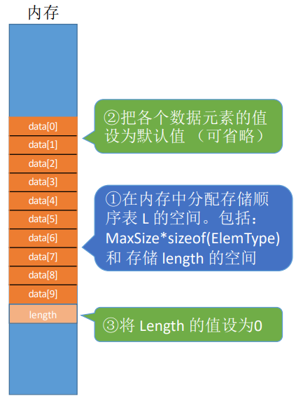
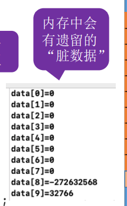
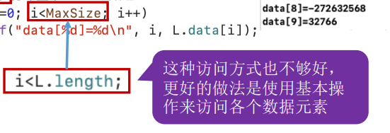

==基本操作:GetElem(L,i) #E91E63==


``` c
#define MaxSize 10    //定义最大长度
typedef struct{
ElemType data[MaxSize];  //用静态的”数组“存放数据元素 **重点
int length;  //顺序表的当前长度
} SqList;   //顺序表的类型定义（静态分配方式）
```
==ElemType data[MaxSize] 最为重要 #673AB7==

==Q：如果”数组“存满了怎么办？ #E91E63==
==A：可以放弃治疗，顺序表的表长刚开始确定后就无法更改（存储空间是**静态**的） #03A9F4==

==思考：如果刚开始就声明一个很大的内存空间呢？存在什么问题？ #E91E63==
==回答：上海中心大厦了解一下。 #03A9F4==


### 动态分配

``` c
#define MaxSize 10    //定义最大长度
typedef struct{
ElemType *data;  //指示动态分配数组的指针  **重点
int MaxSize;     //顺序表的最大容量
int length;      //顺序表的当前长度
} SqList;        //顺序表的类型定义（静态分配方式）
```

Key：动态申请和释放内存空间

C ———— malloc ==申请 #9E9E9E==、free ==释放 #9E9E9E== 函数 
                   L.data = ==(ElemType *) #E91E63==malloc (==sizeof(ElemType) * InitSize #4CAF50==);
==malloc函数返回一个之指针，需要强制转型为你定义的数据元素类型指针。ElemType可是int，struct等 #E91E63==
				 
 ==malloc函数的参数，指明要分配多大的**连续**内存空间 
 eg：int = 4B InitSize = 10
 sizeof == 40  #4CAF50==
				   
C++ ———— new ==申请 #9E9E9E==，delete ==释放 #9E9E9E== 关键字
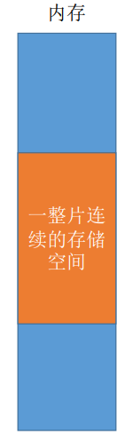

``` c
#include <stdlib.h>  //malloc，free函数的头文件

#define InitSize 10 //默认的最大长度
typedef struct{
     int *data; //指示动态分配数组的指针
     int MaxSize;//顺序表的最大容量
     int length;//顺序表的当前长度
}SeqList;

void InitList(SeqList &L){
     //用 malloc 函数申请一片连续的存储空间
	 L.data = (int *)malloc(InitSize*sizeof(int));
	 L.length = 0;
	 L.MaxSize = InitSize;
}
//增加动态数组的长度
void IncreaseSize(SeqList &L, int len){
     int *p=L.data;
	 L.data=(int *)malloc((L.MaxSize+len)*sizeof(int));
	 for (int i = 0; i < L.length ; i ++){
	             L.data[i] =p[i];            //将数据复制到新区域 （时间开销大 = 时间复杂度大）
	 }
     L.MaxSize = L.MaxSize+len; //顺序表最大长度增加len
	 free(p);                   //释放原来的内存空间（之前malloc开的空间释放，
}

int main(){
     SeqList L; //声明一个顺序表
     InitList(L); //初始化顺序表
     //...往顺序表中随便插入几个元素...
	 IncreaseSize(L,5);
	 return 0;
}
```
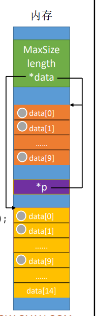
==SeqList L 声明一个顺序表 #4CAF50==
==malloc返回的值= L.data L.data = (int *)malloc(InitSize*sizeof(int)); #FF9800==
==*p = L.data(顺序表拓展) int *p=L.data; #673AB7==
 ==malloc函数申请多一整片的空间 
 L.data=(int *)malloc((L.MaxSize+len)*sizeof(int));  #FFC107==
 
 ==注：realloc函数也可以实现。 #9E9E9E==
 
 

### 顺序表的特点

①随机访问，即可以在 O(1) 时间内找到第 i 个元素。==代码实现：data[i-1];（静态分配，动态分配也一样） #9E9E9E==

②存储密度高，每个节点只存储数据元素

③拓展容量不方便（即便采用动态分配的方式实现，拓展长度的时间复杂度也比较高）

④插入、删除操作不方便，需要移动大量元素

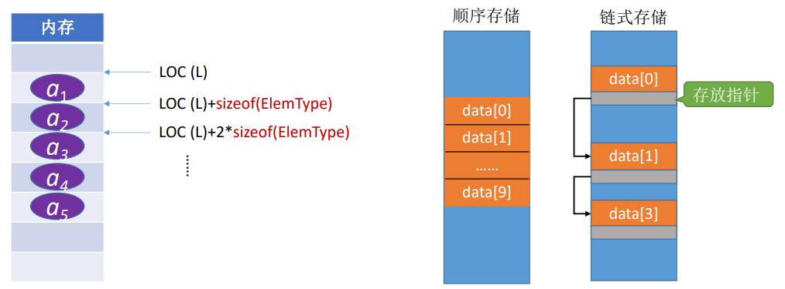

### 顺序表的知识回顾-存储结构，实现方式，特点

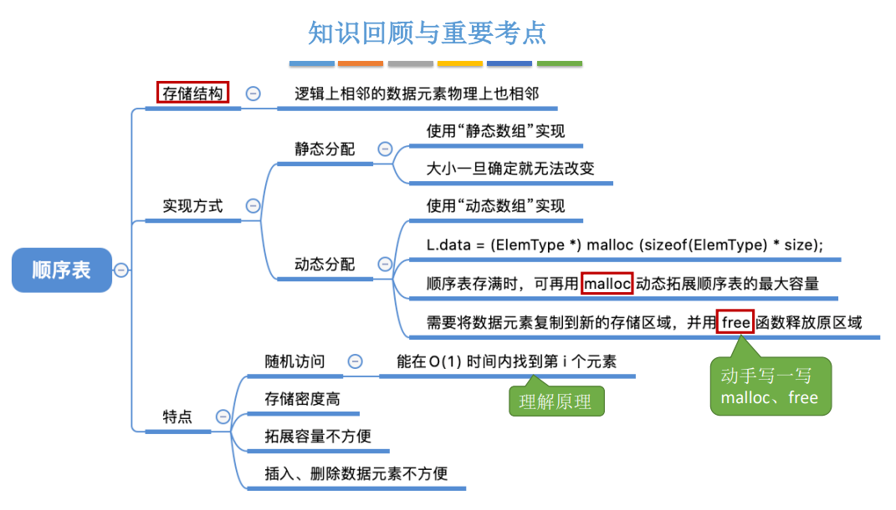

## 顺序表的插入
==用存储位置的相邻来体现数据元素之间的逻辑关系。 #2196F3==

==ListInsert(&L,i,e) #F44336==
:插入操作。在表L的第i个位置==位序 #9E9E9E==上插入指定元素e。
### 代码实现

``` c
#define MaxSize 10      //定义最大长度
typedef struct{
            ElemType data[MaxSize]; //用静态的“数组”存放数据元素
            int length; //顺序表的当前长度
}SqList;                //顺序表的类型定义
```
==注：本节代码建立在顺序表的“静态分配”实现方式之上，“动态分配” 也雷同。 #607D8B==
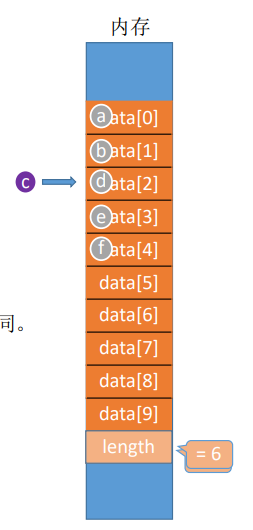
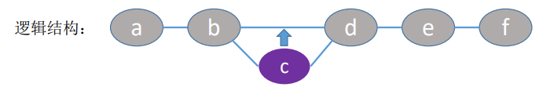

``` c
#define MaxSize 10      //定义最大长度
typedef struct{
            int data[MaxSize]; //用静态的“数组”存放数据元素
			int length; //顺序表的当前长度
}SqList;                //顺序表的类型定义

void ListInsert(SqList &L,int i,int e){
           for(int j = L.length ; j >= i ; j--) //将第i个元素及之后的元素后移
		       L.data[j] = L.data[j-1];
	       L.data[i-1] = e;   //在位置i处放入e
		   L.length++;        //长度加1
}

int main() {
     SqList L;       //声明一个顺序表
	 InitList(L);    //初始化顺序表
	 //...此处省略一些代码，插入几个元素 
     ListInsert(L,3,3);
	 return 0;  
 
}
```
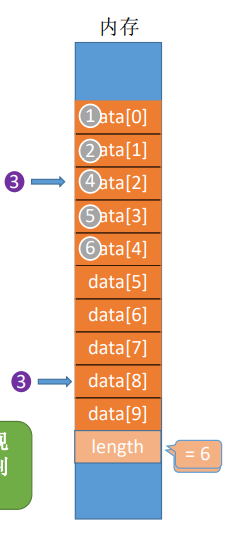

== for(int j = L.length ; j >= i ; j--)
  L.data[j] = L.data[j-1]; #9E9E9E==

 ==L.data[i-1] = e; #9C27B0==

==void ListInsert(SqList &L,int i,int e) #E91E63==
 基本操作：在L的位序i处插入元素e
==L.data[j] = L.data[j-1] #2196F3== 
 注意位序，数组下标的关系，并从后面的元素依次移动。
 
 
 <h3>再改进：（健壮性）</h3>
 
 ``` c
#define MaxSize 10      //定义最大长度
typedef struct{
            int data[MaxSize]; //用静态的“数组”存放数据元素
			int length; //顺序表的当前长度
}SqList;                //顺序表的类型定义

bool ListInsert(SqList &L,int i,int e){
          if(i<1||i>L.length+1)   //判断i的范围是否有效
		            return    false;
					if (L.length >= MaxSize) //当前存储空间已满，不能插入
					return    false;
		   for(int j = L.length ; j >= i ; j--) //将第i个元素及之后的元素后移
		       L.data[j] = L.data[j-1];
	       L.data[i-1] = e;   //在位置i处放入e
		   L.length++;        //长度加1
		   return true;
}

int main() {
     SqList L;       //声明一个顺序表
	 InitList(L);    //初始化顺序表
	 //...此处省略一些代码，插入几个元素 
     ListInsert(L,3,3);
	 return 0;  
 
}
```

==好的算法，应该具有“健壮性”能处理异常情况，并给使用者反馈。 #00BCD4==
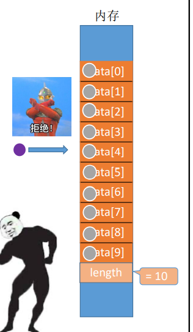

### 时间复杂度分析
**关注最深层循环语句的执行次数与问题规模n的关系。**
 ``` c
bool ListInsert(SqList &L,int i,int e){
          if(i<1||i>L.length+1)   //判断i的范围是否有效
		            return    false;
					if (L.length >= MaxSize) //当前存储空间已满，不能插入
					return    false;
		   for(int j = L.length ; j >= i ; j--) //将第i个元素及之后的元素后移
		       L.data[j] = L.data[j-1];
	       L.data[i-1] = e;   //在位置i处放入e
		   L.length++;        //长度加1
		   return true;
}
```

最深层循环语句   **==L.data[j] = L.data[j-1]; #00BCD4==** 
问题规模 n = L.length ( 表长 )

==最好情况 #2196F3==
新元素插入到表尾，不需要移动元素
i = n+1，循坏0次；最好时间复杂度 = O(1)
==最坏情况 #F44336==
新元素插入到表头，需要将原有的n个元素全都向后移动
i = 1，循坏 n 次；最坏时间复杂度 = O(n)
==平均情况 #673AB7==
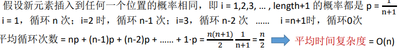


## 顺序表的删除
==ListDelete(&L,i,&e) #F44336== 删除操作
删除表L中第i个位置的元素，并用e返回删除元素的值。
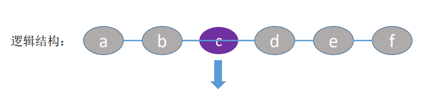
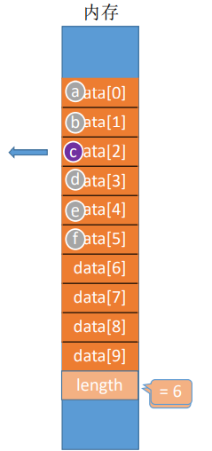
### 代码实现

``` c
bool ListDelete(SqList &L,int i,int &e){
        if(i < 1 || i>L.length ) //判断i的范围是否有效
		       return false;
		 e = L.data[i - 1];   //将被删除的元素赋值给e
		 for(int j=i ; j <L.length ; j++)  //将第i个位置后的元素前移
		     L.data[j-1] = L.data[j];  
	     L.length--;    //线性表长度减1
		 return true;
} 

int main(){
         SqList L;   //声明一个顺序表
		 InitList(L); //初始化顺序表
		 //......
		 int e = -1;   //用变量e把删除的元素"带回来"
		 if (ListDelete(L,3,e))
		       prinf("已删除第3个元素，删除元素值为=%d\n", e);
	     else
		       prinf("位序i不合法，删除失败\n");
		 return 0;
}

```
==bool ListDelete(SqList &L,int i,int &e) #F44336==
注意是引用型+ bool函数(true false.)

那么 ListDelete的函数里的L和main函数里的函数没啥关系了，ListDelete的L 只是 Main里的 L 的复制品。
### 时间复杂度分析


``` c
bool ListDelete(SqList &L,int i,int &e){
        if(i < 1 || i>L.length ) //判断i的范围是否有效
		       return false;
		 e = L.data[i - 1];   //将被删除的元素赋值给e
		 for(int j=i ; j <L.length ; j++)  //将第i个位置后的元素前移
		     L.data[j-1] = L.data[j];  
	     L.length--;    //线性表长度减1
		 return true;
		 
 ```
 
 **关注最深层循环语句的执行次数与问题规模 n 的关系**
==L.data[j-1] = L.data[j]; #F44336== 
		 
==最好情况 #2196F3==
删除表尾元素，不需要移动其他元素
i = n ，循环 0次，最好时间复杂度 = O(1)
==最坏情况 #E91E63==
删除表头元素，需要将后续的n-1个元素全都向前移动
i = 1 ，循坏n-1次，最坏时间复杂度 = O(n)
==平均情况 #673AB7==
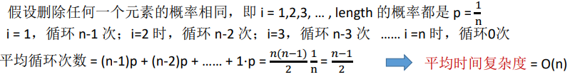

## 知识回顾 - 顺序表的基本操作 - 插入、删除
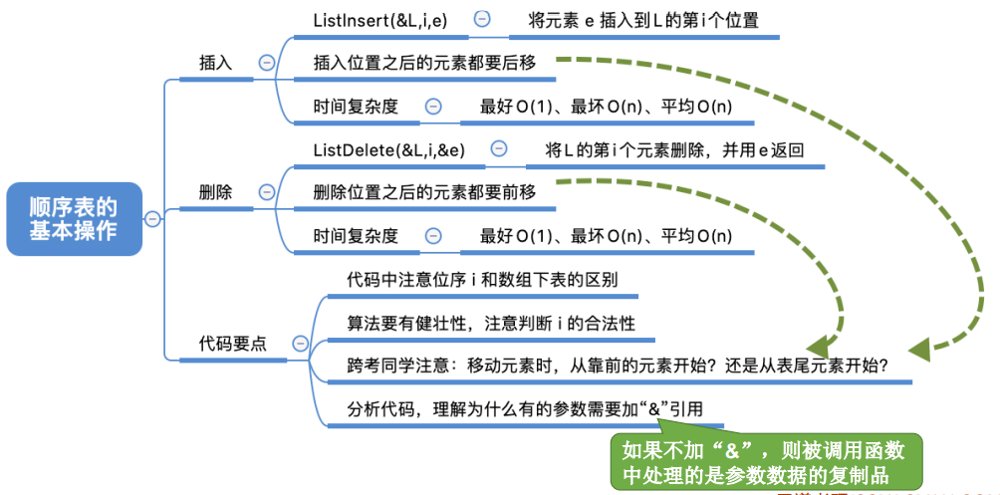

## 按位查找

### 代码实现

==GetElem(L,i) #E91E63==
按位查找操作
获取表L中第i个位置的元素的值

==静态分配 #00BCD4==
``` c
#define MaxSize 10    //定义最大长度
typedef struct{     
      ElemType data[MaxSize]; //用静态的“数组”存放数据元素（静态分配）
	  int length;           //顺序表的当前长度 
} SqList;                  //顺序表的类型定义（静态分配方式）

ElemType GetElem(SqList L,int i){
         return L.data [i-1];
}
```

==动态分配 #4CAF50==
``` c
#define InitSize 10    //定义最大长度
typedef struct{     
      ElemType *data;// 指示动态分配数组的指针
	  int MaxSize;           //顺序表的最大容量
	  int length;           //顺序表的当前长度 
} SqList;                  //顺序表的类型定义（动态分配方式）

ElemType GetElem(SqList L,int i){
         return L.data [i-1];
}
```
==ElemType *data #F44336==
如果一个ElemType 占 6B，即 sizeof(ElemType) == 6
指针data指向的地址为2000

==int *p #03A9F4==
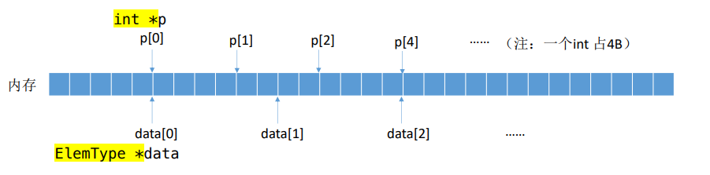
``` c
#define InitSize 10    //定义最大长度
typedef struct{     
      int *data;// 指示动态分配数组的指针
	  int MaxSize;           //顺序表的最大容量
	  int length;           //顺序表的当前长度 
} SqList;                  

void InitList(SeqList &L){
// 用malloc 函数申请一片连续的存储空间
L.data = (int *)malloc(InitSize*sizeof(int));
L.length = 0;
L.MaxSize = InitSize;


}
```
==L.data = (int *)malloc(InitSize*sizeof(int)); #F44336==
malloc 要强制变成和 int *data一样的数据，所以必须强制(int * )

### 时间复杂度分析
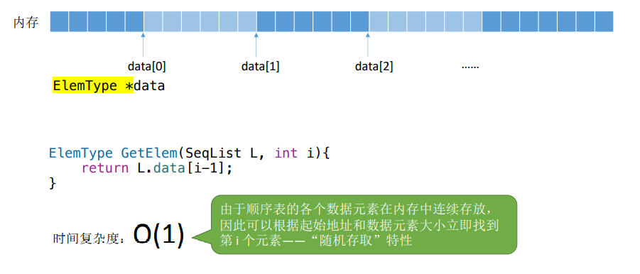


## 按值查找

==LocateElem(L,e) #03A9F4==
按值查找，在表L中查找具有给定关键字值的元素。
### 代码实现
``` c
#define InitSize 10   //顺序表的初始长度
typedef struct{
       int *data;           //指示动态分配数组的指针
	   int MaxSize;     //顺序表的最大容量
	   int length;        //顺序表的当前长度
}SeqList;               //顺序表的类型定义（动态分配方式）

// 在顺序表L中查找第一个元素值等于e的元素，并返回其位序。
int LocateElem(SeqList L,ElemType e){
   for(int i = 0; i <L.length;i++)
     if(L.data[i] == e)
	       return i+1;            //数组下标为i的元素值等于e，返回其位序i+1
     return 0;      //退出循坏，说明查找失败


}
```
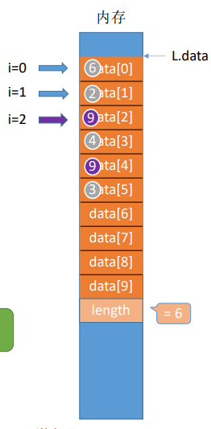
==L.data[i] == e #F44336==
**基本数据类型：**
int ，char，double，float等可以直接使用运算符 “ == ” 进行比较


==问题：结构类型的数据元素也能这样嘛? #E91E63==
==答案：不能 #00BCD4==

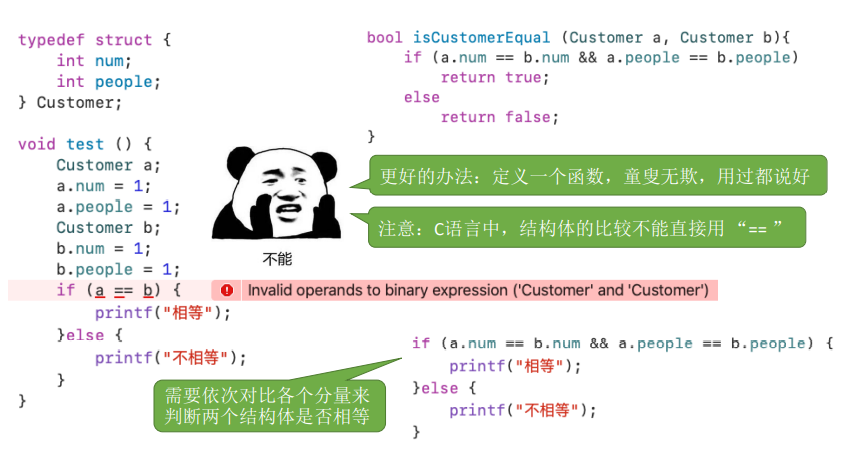

 C++ 的话，可以考虑重载 == 运算符。
 
 ==Tips： #9E9E9E==
==《数据结构》考研初试中，手写代码可以直接用“ == ”，无论 ElemType 是基本数据类型还是结构类型
手写代码主要考察学生是否能理解算法思想，不会严格要求代码完全可运行
有的学校考《C语言程序设计》，那么…也许就要语法严格一些 #607D8B==

### 时间复杂度分析

``` c
int LocateElem(SeqList L,ElemType e){
   for(int i = 0; i <L.length;i++)
     if(L.data[i] == e)
	       return i+1;            
     return 0;      
}
```
 ==for(int i = 0; i <L.length;i++)
     if(L.data[i] == e) #F44336==
==关注最深层循坏语句的执行次数与问题规模n的关系 #FF9800==

==最好情况 #2196F3==
目标元素在表头
循环 1次；最好时间复杂度 = O(1)
==最坏情况 #E91E63==
目标元素在表尾
循坏n次，最坏时间复杂度 = O(n)
==平均情况 #673AB7==
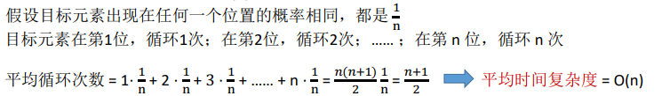

## 顺序表的基本操作 - 查找 知识回顾

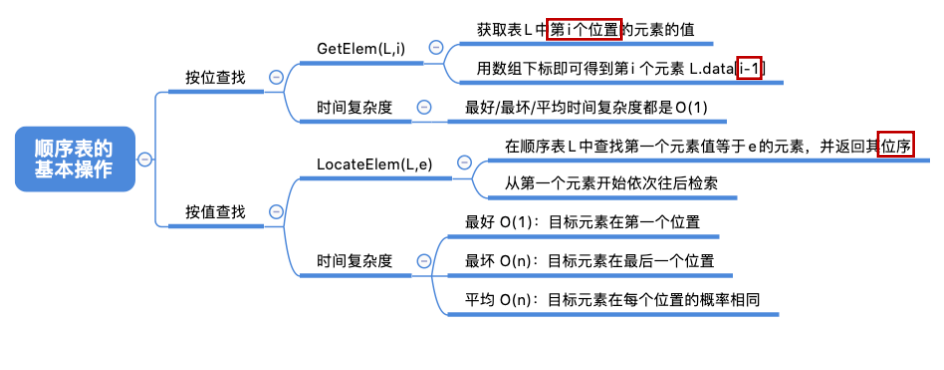
